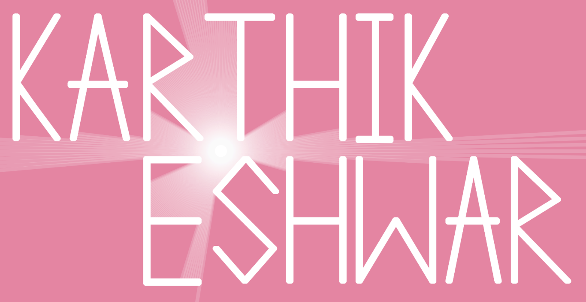

<!-- <body style="background-color:white;"> -->
<h3 align="center">
<!--  -->
  
<!-- 
 -->
<!--  -->

</h3>

I'm a computer science student interested in artificial intelligence, machine learning and human-computer interaction.
 

 

| Projects                                               | Description                                                                                            | Team size & date |
| ------------------------------------------------------ | ------------------------------------------------------------------------------------------------------ | ---------------- |
| [Araam](https://github.com/Karthikeshwar1/Araam)       | Control your PC with just a controller!                                                                | 1, Aug 2021      |
| [airPiano](https://github.com/Karthikeshwar1/airPiano) | A software with which you can play piano in the air, or play a bigger piano with the computer keyboard | 1, Mar-Apr 2021  |
| [TABFYE](https://github.com/Karthikeshwar1/TABFYE)     | Take-A-Break-For-Your-Eyes!                                                                            | 4, Jun 2020      |
| [JumpG](https://github.com/Karthikeshwar1/JumpG)       | A Windows console game inspired from Google's T-rex game!                                              | 2, Apr-Jun 2019  |
| [GRA](https://github.com/Karthikeshwar1/GRA)           | Gesture Recognition Application (for RevaHack 2020)                                                    | 4, Nov 2020      |

 

| Mini-projects                                                                                | Description                                                  |
| -------------------------------------------------------------------------------------------- | ------------------------------------------------------------ |
| [screenRec](https://github.com/Karthikeshwar1/screenRec)                                     | A screen recorder to take screenshots and record video       |
| [controller-vibration-tester](https://github.com/Karthikeshwar1/controller-vibration-tester) | A python script to test vibration motors of game controllers |
| [Misc](https://github.com/Karthikeshwar1/Misc)                                               | miscellaneous                                                |
| [Wiki-Wordcloud-Maker](https://github.com/Karthikeshwar1/Wiki-Wordcloud-Maker)               | Creates a wordcloud image based on a given Wikipedia article |
| [Etcch-A-Sketch](https://github.com/Karthikeshwar1/Etcch-A-Sketch)                           | Drawing app inspired from the popular toy Etch A Sketch      |
| [algorithms_visualization](https://github.com/Karthikeshwar1/algorithms_visualization)       | Visualizing algorithms using Processing 3                    |
| [The Witcher 3 Haircut Preview](https://github.com/Karthikeshwar1/TheWitcher3HaircutPreview) | Preview haircuts in the game The Witcher 3                   |
| [LIARG!](https://github.com/Karthikeshwar1/LIARG) (Prototype)     | A software to help track your tasks RPG style! |

 

| [Articles](https://github.com/Karthikeshwar1/blog)                                                                                |
| --------------------------------------------------------------------------------------------------------------------------------- |
| [Essential Software For Computers](https://github.com/Karthikeshwar1/blog/blob/main/2021/Essential_Software_For_Computers.md)     |
| [Essential Software For Smartphones](https://github.com/Karthikeshwar1/blog/blob/main/2021/Essential_Software_For_Smartphones.md) |
| [Recommended Books On Computers And Tech](https://github.com/Karthikeshwar1/blog/blob/main/2022/Recommended_Books_On_Computers_And_Tech.md)  |
| [Song Of The Year](https://github.com/Karthikeshwar1/blog/blob/main/2022/Song_Of_The_Year.md) |

 

| Artwork                                                          | Description                          |
| ---------------------------------------------------------------- | ------------------------------------ |
| [Game-captures](https://github.com/Karthikeshwar1/Game-captures) | Amazing photos captured within games |

<h3 align="center">

</h3>

Github stats

  

<h3 align="center">

<!--  -->

</h3>
 

<!--

 -->
