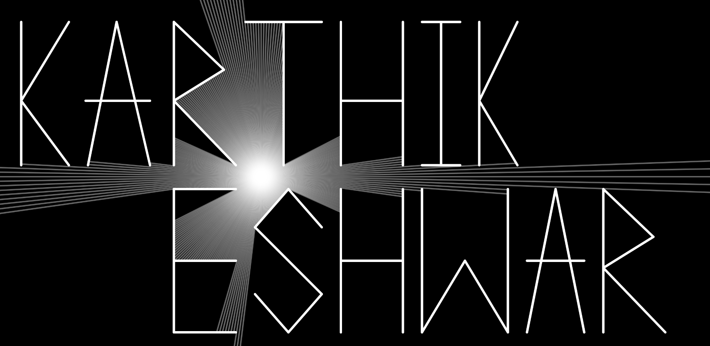

<h3 align="center">

<!--  -->

</h3>

I'm a computer science student interested in artificial intelligence, machine learning and human-computer interaction.
 
I'm here to send waves out in the universe.
 
Naah, just kidding

<table>
<tr>
<td>

</td>
<td>

</td>
</tr>
</table>

<h3 align="center">

</h3>
